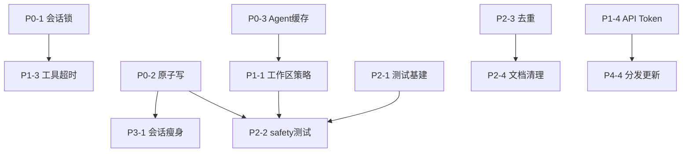

# 星期五 — 项目优化计划

> 版本：2026-06-07  
> 范围：稳定性、安全、性能、工程卫生、产品迭代  
> 原则：小步交付、每阶段可独立验收、不破坏现有用户体验

---

## 背景

「星期五」架构清晰：**pywebview 壳 → 本地 FastAPI → WebSocket Agent → 28 个本地工具**。  
当前主要短板：并发安全、安全策略边界、数据持久化可靠性、零自动化测试、文档与打包不一致。

---

## 总览

| 阶段 | 主题 | 预估工时 | 优先级 |
|------|------|----------|--------|
| P0 | 正确性 & 数据安全 | 3–5 天 | 🔴 必做 |
| P1 | 安全加固 & 性能 | 3–5 天 | 🟠 高 |
| P2 | 测试 & 工程卫生 | 2–4 天 | 🟡 中 |
| P3 | 存储 & 前端演进 | 3–5 天 | 🟢 中低 |
| P4 | 产品差异化 | 持续迭代 | 🔵 长期 |

---

## P0 — 正确性 & 数据安全

> 目标：消除并发错乱与数据损坏风险，改动小、收益最大。

### P0-1 服务端会话锁

**问题**  
`server.py` 中 WebSocket 收到消息后直接 `asyncio.create_task(_run_chat(...))`，无 per-session 锁。前端虽有 `busy`，但服务端不 enforce，同一 session 可能并发执行，导致 Agent 消息历史、审批流程竞态。

**涉及文件**  
- `friday/server.py`
- `web/chat.js`（可选：对齐错误提示）

**任务**  
1. 新增 `_session_locks: dict[str, asyncio.Lock]`，懒创建
2. `_run_chat` 入口 `async with lock`，或在 WS handler 层串行化
3. 并发请求时返回明确 WS 事件（如 `{"type":"busy"}`），前端提示「请等待当前任务完成」
4. 删 session 时清理对应 lock

**验收标准**  
- [x] 同一 session 快速连发两条消息，第二条排队或拒绝，不产生消息错乱
- [x] 不同 session 仍可并行
- [x] 取消（stop）与锁不 deadlock

> ✅ 2026-06-07：`server.py` 增加 `_run_chat_guarded` + `_session_locks`；`chat.js` 处理 `busy` 事件。

---

### P0-2 JSON 持久化原子写

**问题**  
`settings.json`、会话 JSON、`operations.json`、`schedules.json` 均直接 `write_text`，崩溃时可能半写损坏。

**涉及文件**  
- `friday/storage.py`
- `friday/sessions.py`
- `friday/operations.py`
- `friday/schedules.py`

**任务**  
1. 新增 `friday/io_utils.py`（或 `storage.py` 内）：
   ```python
   def atomic_write_json(path: Path, data: Any) -> None:
       # 写 path.with_suffix(".tmp") → fsync → os.replace
   ```
2. 所有 `json.dump` / `write_text` 持久化统一走此函数
3. 读失败时：记录日志 + 尝试 `.bak` 回退（可选）

**验收标准**  
- [x] 模拟 kill 进程后，settings / session 文件可正常解析或自动恢复
- [x] 无 `.tmp` 残留（或启动时清理）

> ✅ 2026-06-07：新增 `friday/io_utils.py`（tmp + fsync + replace + `.bak` 备份）；四处持久化已迁移。

---

### P0-3 Agent 缓存生命周期

**问题**  
`_agent_cache` 仅在删 session 时 `pop`；修改 API Key、工作区、安全策略后，旧 Agent 仍用旧配置。

**涉及文件**  
- `friday/server.py`
- `friday/storage.py`（save_settings 钩子）

**任务**  
1. `save_settings()` 成功后调用 `clear_agent_cache()` 或按 session 失效
2. 可选：LRU 上限（如 20 个 session），超出 evict 最久未用
3. 设置变更 WS 广播 `settings_updated`，前端可选刷新状态

**验收标准**  
- [x] 改 API Key 后下一条消息使用新 Key
- [x] 改 `restrict_to_workspace` 后立即生效
- [ ] 长时间运行内存不无限增长（LRU 留待后续）

> ✅ 2026-06-07：`save_settings` 后 `clear_agent_cache()`；删 session 时同步清理 lock。

---

## P1 — 安全加固 & 性能

> 目标：补齐安全策略漏洞，避免工具执行拖垮响应。

### P1-1 工作区路径策略扩展

**问题**  
`restrict_to_workspace` 仅限制 `WRITE_TOOLS`；只读工具可读任意路径。

**涉及文件**  
- `friday/safety.py`
- `friday/tools/*.py`（路径参数统一校验入口）

**任务**  
1. 新增 `ALL_PATH_TOOLS` 集合（读+写所有带 path 参数的工具）
2. `evaluate_tool` 在 `restrict_to_workspace=True` 时校验全部路径类工具
3. 设置页文案更新：「严格模式：所有文件访问限制在工作区内」
4. 可选：保留「仅限制写入」作为次级选项（`workspace_mode: write_only | strict`）

**验收标准**  
- [x] 严格模式下，`read_text_file("C:/Windows/...")` 被拦截
- [x] 关闭限制时行为与现版一致
- [x] 操作历史正确记录拦截原因

> ✅ 2026-06-07：新增 `PATH_TOOLS`；`evaluate_tool` 对工作区内外全部路径类工具校验；设置页文案已更新。

---

### P1-2 剪贴板写入纳入审批

**问题**  
`clipboard_write` 在 `READ_ONLY_TOOLS`，写入剪贴板无需审批。

**涉及文件**  
- `friday/safety.py`
- `friday/tools/media.py`

**任务**  
1. 从 `READ_ONLY_TOOLS` 移除 `clipboard_write`
2. 归入 `WRITE_TOOLS` 或单独 `CLIPBOARD_TOOLS`，风险等级 `WRITE`
3. 默认需审批（与 `write_text_file` 一致）

**验收标准**  
- [x] 开启审批时，clipboard_write 弹出确认
- [x] 拒绝后不写入剪贴板

> ✅ 2026-06-07：`clipboard_write` 移入 `WRITE_TOOLS`，走 `require_approval_writes` 审批链。

---

### P1-3 工具执行超时与隔离

**问题**  
Agent 在 `asyncio.to_thread` 中同步执行工具；PowerShell、大目录搜索、大文件 MD5 长时间占用线程池。

**涉及文件**  
- `friday/agent.py`
- `friday/tools/registry.py` 或 `execute_tool` 包装层
- `friday/tools/system.py`（cpu_percent）
- `friday/tools/filesystem.py`（search_files）

**任务**  
1. `execute_tool` 包装：`concurrent.futures` + `timeout`（读 30s / 写 60s / shell 120s 分级）
2. 超时返回结构化错误，Agent 可告知用户
3. `get_system_status`：`cpu_percent(interval=None)` 或 5s 缓存
4. `search_files`：加 `max_depth`（默认 8）、跳过系统目录（`$Recycle.Bin`、`System Volume Information` 等）

**验收标准**  
- [x] 故意 `Start-Sleep 999` 的 PowerShell 在超时后终止并返回错误
- [x] 搜索 C:\ 根目录不会无限 hang
- [x] 正常小文件操作不受影响

> ✅ 2026-06-07：`registry.execute_tool` 线程池 + 分级超时（30/60/120s）；`search_files` 限深 + 跳过系统目录；`cpu_percent(interval=None)`。

---

### P1-4 本地 API Token 认证

**问题**  
127.0.0.1 无认证，本机任意进程可调用 API / 伪造审批。

**涉及文件**  
- `friday/server.py`
- `friday/desktop.py`
- `web/utils.js` / `web/chat.js`

**任务**  
1. 启动时生成随机 token（32 字节 hex），存内存
2. 主界面 URL：`/?desktop=1&boot=...&token=...`
3. FastAPI 中间件校验 `X-Friday-Token`（health、静态资源除外）
4. 前端 fetch / WebSocket 统一带头

**验收标准**  
- [x] 无 token 的 curl 请求返回 401
- [x] WebView 内正常使用
- [x] token 不落盘（每次启动不同）

> ✅ 2026-06-07：新增 `friday/auth.py`；HTTP 中间件 + WS query token；`utils.js` 统一 `apiFetch`；桌面 URL 带 token。

---

### P1-5 定时任务写权限默认值

**问题**  
`auto_approve_scheduled_writes=True` 时无人值守可自动写文件，风险偏高。

**涉及文件**  
- `friday/storage.py`（默认值）
- `friday/task_runner.py`
- `web/schedules.js`、设置页 UI

**任务**  
1. 默认值改为 `False`
2. 已有用户 settings 迁移：仅新安装生效，或首次升级弹窗说明
3. UI 加醒目提示：「开启后定时任务可自动修改文件，请谨慎」

**验收标准**  
- [x] 新安装默认不自动写
- [x] 现有用户升级行为文档化

> ✅ 2026-06-07：`UserSettings.auto_approve_scheduled_writes` 默认 `False`；已有 settings.json 保留原值；定时任务页增加风险提示。

---

## P2 — 测试 & 工程卫生

> 目标：可回归、可维护、文档与代码一致。

### P2-1 自动化测试基础设施

**涉及文件**  
- 新建 `tests/`
- `requirements-dev.txt`（pytest、pytest-asyncio、httpx）
- 可选 `.github/workflows/ci.yml`

**任务**  
1. `pytest` + `tests/conftest.py`（临时 APPDATA 目录 fixture）
2. 核心用例（见 P2-2）
3. CI：push 时跑 pytest

**验收标准**  
- [x] `pytest` 本地 green
- [x] 至少 15 个有意义的断言

> ✅ 2026-06-07：`tests/` + `requirements-dev.txt` + `.github/workflows/ci.yml`；26 项测试通过。

---

### P2-2 优先测试覆盖

| 模块 | 用例 |
|------|------|
| `safety.py` | `evaluate_tool` 各风险等级；`path_in_workspace` 边界（..、 symlink） |
| `storage.py` | Fernet 加解密；`atomic_write_json` 原子性 |
| `tools/registry.py` | `parse_tool_arguments` 非法 JSON |
| `sessions.py` | CRUD；损坏 JSON 处理 |
| `single_instance.py` | 端口占用 mock（可选集成测试） |
| `tools/shell.py` | 危险命令黑名单样本 |

**验收标准**  
- [x] 上述模块均有对应 test 文件
- [x] 改 safety 逻辑时 CI 能捕获回归

> ✅ 2026-06-07：覆盖 safety / io_utils / storage / registry / sessions / shell / instance_lock。

---

### P2-3 消除重复代码

**任务**  
1. **单实例**：抽 `friday/instance_lock.py`，`single_instance.py` 与 `pyi_rth_single_instance.py` 共用核心逻辑（runtime hook 仅保留最小 bootstrap）
2. **WRITE_TOOLS**：`safety.py` 单一来源，`operations.py` import
3. **ensure_single_instance**：仅 `run.py` 调用一次，或 `desktop.main()` 内去掉重复调用

**验收标准**  
- [x] 重复代码行数显著减少
- [x] 打包后单实例行为不变

> ✅ 2026-06-07：新增 `friday/instance_lock.py`；runtime hook 精简；`desktop.main()` 去掉重复单实例调用。

---

### P2-4 文档 & 版本 & 依赖清理

**任务**  
| 项 | 动作 |
|----|------|
| README 打包说明 | 改为 onedir：`dist/星期五/星期五.exe` + `_internal/` |
| README 前端文件列表 | 补全 `history.js`、`schedules.js`、`onboarding.js` |
| 版本号 | 统一 `__init__.py` 与 `scripts/version_info.py`（建议 `1.0.0`） |
| `python-dotenv` | 从 `requirements.txt` 移除，或实现 `.env` → settings 迁移 |
| `.env.example` | 删除或标注废弃 |
| `setup.ps1` | 去掉复制 `.env` 步骤 |
| 静态资源版本 | `styles.css` / JS 统一 `?v=` 或改用构建 hash |

**验收标准**  
- [x] README 与 `friday.spec` 描述一致
- [x] 版本号一处修改全局生效
- [x] 新用户 setup 流程无 `.env` 困惑

> ✅ 2026-06-07：`friday/version.py` 1.0.0；移除 python-dotenv / .env.example；静态资源统一 `?v=28`。

---

## P3 — 存储优化 & 前端演进

> 目标：长期使用不膨胀，前端可扩展。

### P3-1 会话存储瘦身

**问题**  
每个 session JSON 存完整 `agent_messages`（含 tool 消息），`%APPDATA%` 体积与启动加载时间随使用增长。

**任务**  
1. 分离「展示消息」与「Agent 上下文」：
   - `messages`：user/assistant 摘要（UI 用）
   - `agent_state`：完整 tool 链（可选压缩）
2. 或：tool 详情仅存 `operations.json`，session 只存引用 ID
3. 迁移脚本：启动时检测旧格式并升级

**验收标准**  
- [x] 100 轮对话 session 文件 < 合理阈值（如 500KB）
- [x] 旧 session 自动迁移可读

> ✅ 2026-06-07：v2 格式（`display_messages` + 压缩 `agent_messages`）；`migrate_session_files()` 启动时自动升级。

---

### P3-2 错误可观测性

**任务**  
1. 设置页 → 通用 →「打开日志文件夹」按钮（打开 `%APPDATA%\Friday\`）
2. 设置页显示最近错误摘要（读 log 尾部，可选）
3. 启动失败 HTML 页加「查看日志」链接

**验收标准**  
- [x] 用户可自助定位启动/API 失败原因

> ✅ 2026-06-07：设置 → 通用 → 日志摘要 + 打开文件夹；`GET /api/diagnostics/logs`；启动失败页显示日志路径。

---

### P3-3 启动速度（Lazy Import）

**任务**  
1. `friday/tools/` 按需 import（registry 注册时 lazy load 重组件：pymupdf、pptx、docx）
2. `desktop.py` 后端线程延迟 import uvicorn / agent 依赖
3. 打包后对比冷启动时间（目标：再减 1–2s）

**验收标准**  
- [x] 冷启动时间可测量并记录 baseline
- [x] 首次调用 PDF/Word 工具时才加载对应库

> ✅ 2026-06-07：`registry` 延迟加载 documents/media；`documents.py` 函数内 import docx/pptx；`brain` 首次对话才 `get_tool_definitions()`。

---

### P3-4 前端模块化（长期）

**现状**  
纯 IIFE + `window.Friday`，10 个 JS 文件，无构建工具。

**任务**（仅当功能继续膨胀时启动）  
1. 引入 esbuild：ES modules + 单 bundle 输出
2. TypeScript 可选（类型安全 settings / WS 协议）
3. 组件化：Settings、Chat、History 独立模块

**验收标准**  
- [ ] 开发模式 HMR 或 watch rebuild
- [ ] 打包体积与现版相当

---

## P4 — 产品差异化（持续迭代）

> 与 P0–P3 可并行，按用户价值排序。

### P4-1 技能 / 模板

- 常用操作一键 chip（整理下载文件夹、系统体检、周报生成）
- 用户自定义技能存 `skills.json`
- 欢迎页 + 输入框 `/` 命令补全

> ✅ 2026-06-07：`friday/skills.py` + `/api/skills`；`web/skills.js` 动态欢迎页、斜杠补全、设置页技能管理。

### P4-2 操作历史增强

- 筛选：按工具名、风险等级、时间
- 导出 CSV / JSON
- 「重放」：从历史一键重新发起相同操作

> ✅ 2026-06-07：`operations.py` 扩展筛选/导出/重放；`history.js` 高级筛选 + 导出 + 重放按钮。

### P4-3 定时任务增强

- Cron 表达式支持（现版若为简单间隔则扩展）
- 任务执行日志独立页
- 失败重试 + 通知（系统托盘，可选）

> ✅ 2026-06-07：`schedules.py` 支持 interval/cron/重试；`croniter` 依赖；`/api/schedules/{id}/runs`；`schedules.js` 执行记录面板。（托盘通知留作可选）

### P4-4 分发 & 更新

- 版本检查 API（GitHub Releases）
- 增量更新或「下载新版本」引导
- 安装包签名（长期）

> ✅ 2026-06-07：`friday/updates.py` + `GET /api/updates/check`；设置页版本显示与下载引导。（签名仍为长期项）

---

## 依赖关系



**建议实施顺序：**

```
Week 1:  P0-1 → P0-2 → P0-3
Week 2:  P1-1 → P1-2 → P1-3
Week 3:  P1-4 → P1-5 → P2-1 → P2-2（核心用例）
Week 4:  P2-3 → P2-4 → P3-2
之后:    P3-1 → P3-3 → P4 按优先级择项
```

---

## 风险与注意事项

| 风险 | 缓解 |
|------|------|
| 工作区严格模式破坏老用户习惯 | 默认保持现行为，严格模式 opt-in |
| 会话存储迁移丢数据 | 迁移前写 `.bak`；原子写 |
| API Token 导致 WebView 加载失败 | token 仅校验 API 路由，静态资源放行 |
| 工具超时误杀合法长任务 | 分级超时 + 用户可配置 |
| 测试覆盖不足仍上线 | P0/P1 每项必须有手动验收清单 |

---

## 不在本计划内（明确排除）

- 多用户 / 云端同步
- 替换 DeepSeek 为多模型路由（可另开计划）
- 前端 UI 大改版（工业风已完成）
- 启动加载动画（用户已要求取消）
- Git commit / 发版流程（按需另议）

---

## 里程碑

| 里程碑 | 包含 | 完成标志 |
|--------|------|----------|
| **M1 稳定版** | P0 全部 | 无并发错乱、无数据损坏报告 |
| **M2 安全版** | P1 全部 | 安全审计清单通过 |
| **M2.5 可维护版** | P2 全部 | CI green + README 准确 |
| **M3 精简版** | P3-1 ~ P3-3 | 启动更快、数据更小 |
| **M4 产品版** | P4 择项 | 差异化功能上线 |

---

## 附录：关键文件索引

| 区域 | 文件 |
|------|------|
| 桌面壳 | `friday/desktop.py`, `friday/splash.py` |
| 单实例 | `friday/single_instance.py`, `scripts/pyi_rth_single_instance.py` |
| API | `friday/server.py` |
| Agent | `friday/agent.py`, `friday/brain.py` |
| 安全 | `friday/safety.py` |
| 存储 | `friday/storage.py`, `friday/sessions.py` |
| 调度 | `friday/scheduler.py`, `friday/task_runner.py` |
| 工具 | `friday/tools/*.py` |
| 前端 | `web/*.js`, `web/index.html` |
| 打包 | `friday.spec`, `scripts/build.ps1` |

---

*本计划随实现进度更新；完成项在对应 `[ ]` 打勾并注明 PR / 日期。*
