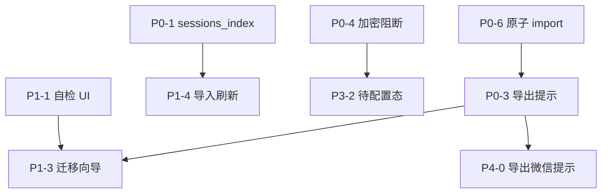

# 星期五 — 可移植性长期优化计划

> 版本：2026-06-08（rev.2，纳入评审反馈）
> 范围：跨设备迁移、新用户首启、配置包、工作区、微信/OpenClaw 生态、Plan/Todo 会话数据
> 原则：**用户只需理解「配置包 + 工作区文件夹」两件事**；其余自愈或明确提示；每阶段可独立验收
> 关联：`friday/portability.py`、`friday/portable_bundle.py`、`docs/PLAN.md`（通用工程计划）

---

## 修订摘要（rev.2）

| 变更 | 说明 |
|------|------|
| 新增 **M1 第一版交付** | 明确「可移植性及格」范围与目标版本，避免 P2–P5 无限拖延 |
| **P2 收窄** | P2-2 / P2-3 / P2-5 降为 backlog；M1 后按需做 P2-1 + P2-4 |
| 新增 **P0-6** | 配置包 import 原子性（先 temp 校验再覆盖） |
| **P0-3 增强** | 导出/导入前主动提示：默认不含会话、不含微信登录态 |
| **P3-1 具体化** | 已知 500 根因 → 前端文案映射表，不只写「看日志」 |
| 新增 **已实现项** | 标注 v1.2.x 已落地能力，避免计划与代码脱节 |

---

## 背景与现状

1.1.3 已引入配置包导出/导入、启动自愈、会话生图相对路径、插件 `{plugin_dir}` 占位符、可移植性自检 API。
1.2.x 补充 MCP 随包迁移、Plan/Todo 面板、开机自启、Onboarding 可跳过等。

**用户仍反馈「可移植性很差」**，根因不是缺某一个功能，而是：

| 维度 | 现状 | 用户感知 |
|------|------|----------|
| 心智模型 | AppData / 工作区 / OpenClaw / runtime 四套位置 | 不知道拷什么、拷了为什么还不工作 |
| 配置包 | 默认不含会话；不含 index / schedules / operations | 「我导出了配置，对话/定时任务没了」 |
| 自愈 | 有 backend，无前端自检 UI；notices 只在加载设置时出现一次 | 问题静默发生，事后才发现 Key 失效 |
| 路径 | 粘贴图仍含绝对路径；agent_messages 历史路径（低优先级） | 换机后偶发图片/旧上下文失效 |
| 微信 | 强绑定 `~/.openclaw` + 本机 runtime | 配置包无法带走微信端 |
| 首启 | 打包版冷启动、API 测试 500、跳过向导后 `apiReady=false` | 新设备第一印象差 |

本计划以 **「换机 / 换用户 / 新装 / 只拷一部分」** 四类场景为主线，分阶段补齐缺口。

---

## 已实现 / 进行中（截至 v1.2.x）

> 计划撰写后已有部分落地，后续修订请同步此表。

| 能力 | 状态 | 关键文件 |
|------|------|----------|
| 微信消息写入「我的微信」会话 | ✅ | `friday/weixin/bridge.py` |
| 桌面端微信会话实时刷新 | ✅ | `friday/ws_broadcast.py`、`web/chat.js` |
| Onboarding 可跳过、health 轮询 | ✅ 部分 | `web/onboarding.js`、`web/app.js` |
| API 测试异常 JSON、非 500 裸错 | ✅ 部分 | `friday/server.py` |
| 配置包含 MCP / 插件 / rules | ✅ | `friday/portable_bundle.py` |
| 可移植性自检 API | ✅ 后端 only | `GET /api/portable/audit` |
| sessions_index 随包导出 | ❌ | P0-1 |
| import 原子性 | ❌ | P0-6 |
| 自检 UI / 迁移向导 | ❌ | P1-1、P1-3 |

---

## M1 第一版交付（可移植性「及格」）

**目标版本**：下一 patch（建议 **v1.2.2** 或 **v1.3.0**，视 P0 体量而定）
**完成标志**：用户能自助完成换机迁移；配置包不再静默丢数据/Key；出问题看得见、知道下一步。

| 包含 | 不含（后续 M2+） |
|------|------------------|
| **P0 全部**（含 P0-6 原子 import、导出提示） | P2-2 agent_messages 路径相对化 |
| **P1-1** 自检 UI | P2-3 workspace id |
| **P1-3** 换机迁移向导 | P2-5 bundle v2（checksum 可并入 P0-2） |
| **P3-2** 待配置态（Composer 引导） | P1 其余项可并行但非 M1 阻塞 |
| **P3-1 子集**：已知 500 → 前端具体文案 | P4 静态说明卡片（导出提示已够 M1） |

**维护者排期（单人项目，无 assignee）**：

```
Week 1  P0-1～P0-6 + 测试
Week 2  P1-1 + P1-3 + P3-2 + P3-1 文案表
Week 3  打包验证 + README 片段更新 → 发 patch
```

---

## 目标架构（终态）

```
┌─────────────────────────────────────────────────────────────┐
│  用户可见的两层迁移单元                                        │
├──────────────────────────┬──────────────────────────────────┤
│  Friday 配置包 (.zip)     │  工作区文件夹 (Documents/星期五)   │
│  AppData 子集             │  用户文件、生图、粘贴图、项目文件    │
│  API/MCP/插件/规则/技能   │  不含 .python-env（到新机重建）     │
│  可选：会话+索引+计划待办  │  路径在 session 内尽量相对化       │
└──────────────────────────┴──────────────────────────────────┘
         │                              │
         └────────── 导入后 ────────────┘
                    ↓
         启动自检 UI + 一键修复向导
                    ↓
              正常使用（微信/OpenClaw 单独说明）
```

**不在本计划终态内（明确边界）：**

- 云端多设备实时同步
- 微信账号 token / OpenClaw 状态跨机无损迁移（仅提供「重新登录指引」）
- 拷贝 `%APPDATA%/Friday/runtime/`（Node/embed Python 必须本机重建）
- 替换 Fernet 为 Windows DPAPI、配置包 password 加密

---

## 场景矩阵（验收基准）

| 场景 | 当前 | M1 目标 | M2+ 目标 |
|------|------|---------|----------|
| A. 新设备装 exe | 可跳过向导；偶发 500 | 待配置态 + 测试失败有具体文案 | onboarding 全绿 |
| B. 旧机 → 新机 | 配置包易丢 index/会话 | 向导 + 导出提示 + index/schedules | 自检全绿 |
| C. 同机换用户 | workspace 自愈 | 向导说明拷 Documents | — |
| D. 只拷 settings | Key 静默失效 | 首屏 banner + api_ready=false | — |
| E. 拷贝工作区 | 生图 OK；粘贴图待 P2-4 | venv 自检提示 | 粘贴图相对化 |
| F. 开发版换目录 | autostart stale | audit 项（P1-1） | 一键修自启 |
| G. MCP 绝对路径 | args 不 audit | P1-2（M2） | — |
| H. 微信端 AI | 已同步桌面（v1.2.x） | **导出时主动提示**不含登录态 | 设置页说明卡片 |

---

## 阶段总览

| 阶段 | 主题 | 预估 | 优先级 | M1 |
|------|------|------|--------|-----|
| **P0** | 数据完整性 & 静默失败 | 3–4 天 | 🔴 必做 | ✅ 全部 |
| **P1** | 迁移体验 & 自检 UI | 3–4 天 | 🟠 高 | 1-1、1-3 |
| **P2** | 路径相对化（**收窄**） | 1–2 天 | 🟢 backlog | 不做 |
| **P3** | 首启/onboarding & 文档 | 2–3 天 | 🟠 高 | 2 + 1 子集 |
| **P4** | 微信/OpenClaw 边界 | 持续 | 🔵 长期 | 导出提示 only |
| **P5** | Plan/Todo 流程债 | 2–3 天 | 🟡 中 | 不做 |

---

## P0 — 数据完整性 & 静默失败

> 目标：配置包 import/export 可信；失败可见、可回滚。

### P0-1 配置包补齐 `sessions_index.json`

**问题**
`export_portable_bundle` 只 glob `sessions/*.json`，不含 `sessions_index.json`（会话顺序、active id）。

**涉及**
- `friday/portable_bundle.py:71-76`
- `friday/sessions.py`

**任务**
1. export：`include_sessions=True` 时写入 `sessions_index.json`
2. import：无 index 时从 session 文件重建最小 index
3. 测试：`test_export_import_with_sessions_index`

**验收**
- [ ] 导出 3 会话 + 指定 active → 导入后顺序与 active 一致

---

### P0-2 配置包纳入 schedules / operations

**问题**
定时任务与操作历史不在 bundle，用户以为「全套配置已备份」。

**涉及**
- `friday/portable_bundle.py`
- `friday/schedules.py`、`friday/operations.py`

**任务**
1. 扩展导出文件列表；`bundle.json` 增加 `included_sections`（轻量 v2，不必单独大版本）
2. report 明确列出含/不含项

**验收**
- [ ] 导出 → 导入后 cron 与操作历史可读取

---

### P0-3 导出/导入语义对称 + **主动提示**

**问题**
- 导出默认不含会话；导入硬编码含会话
- 用户不知道配置包**不含微信登录态**

**涉及**
- `friday/server.py`、`web/settings.js`、`web/index.html`

**任务**
1. 导入 API 增加 `include_sessions` 参数；导出 UI 默认勾选「含会话」或醒目警告「默认不含对话」
2. **导出确认**（M1 必做）：
   - 「此包不含微信扫码登录态，新机需重新配置微信端 AI」
   - 未勾选会话时：「当前包不含对话历史」
3. **导入确认**：「将覆盖 AppData；已备份至 `.import-backup-*`」+ 可选是否覆盖会话

**验收**
- [ ] 导出/导入前用户看到微信与会话范围说明

---

### P0-4 加密密钥未配对 — 阻断提示

**问题**
只拷 `settings.json` 时 Key 静默失效。

**涉及**
- `friday/portability.py`、`friday/storage.py`、`web/app.js`

**任务**
1. `api_ready=false` + reason；全局 banner
2. 导出缺 `.fernet_key` → error 级 report

**验收**
- [ ] 只拷 settings 后首屏可见错误

---

### P0-5 修复 `repair_image_gen_save_dir` 环境变量路径

**涉及** `friday/portability.py:147`

**任务** 目录校验统一 `expand_config_path` → `is_dir()`

**验收**
- [ ] `%USERPROFILE%` 路径不再被误清空

---

### P0-6 配置包 import **原子性**（新增）

**问题**
当前 `import_portable_bundle` 边读 zip 边写 AppData；坏 zip / 磁盘满可能**半覆盖**。虽有 `.import-backup-*`，但需用户手动恢复，无自动回滚。

**涉及**
- `friday/portable_bundle.py:82-149`

**任务**
1. 解压到 `%TEMP%/friday-import-{uuid}/`，校验 `bundle.json` + 必选成员
2. 全部通过后再 `replace` 到 AppData（或逐文件 atomic replace）
3. 任一步失败：**不修改**现配置，返回 `errors` + 已有 `backup_dir` 路径
4. 测试：坏 zip、缺 bundle.json、模拟写入失败

**验收**
- [ ] import 失败后会话/settings 与导入前一致
- [ ] 成功时 backup 仍写入（双保险）

---

## P1 — 迁移体验 & 自检 UI

> M1：**P1-1 + P1-3**；其余 M2。

### P1-1 设置页「可移植性自检」面板 【M1】

**问题** `GET /api/portable/audit` 无前端调用。

**任务**
1. 「运行自检」→ workspace / 加密 / 插件 / venv / MCP / autostart
2. 失败项「去修复」跳转
3. 导入成功后自动跑 audit

**验收**
- [ ] 换机后设置页一眼看到 red 项

---

### P1-2 扩展 audit 覆盖 MCP args 【M2】

（原内容保留，优先级下调）

---

### P1-3 「换机迁移向导」 【M1】

**任务**
1. 设置 → 数据与日志 → 3 步：导出（含会话）→ 拷工作区 → 导入 + 自检
2. 可复制 AppData / 默认工作区路径

**验收**
- [ ] 无需读 README 即可完成迁移

---

### P1-4 导入后前端状态刷新 【M2】

（原内容保留）

---

### P1-5 启动 notices 持久化 【M2】

（原内容保留）

---

## P2 — 路径相对化（**收窄 · backlog**）

> **评审结论**：P2-2 收益/成本比低（用户很少翻旧 thread tool 输出）；M1 不做整阶段。
> **M2 按需**：用户反馈「拷工作区后粘贴图没了」→ 做 P2-4；恢复备份后路径未修 → 做 P2-1。

| 项 | 状态 | 说明 |
|----|------|------|
| **P2-1** marker 可重跑 | backlog | audit「重新扫描并修复」按钮 |
| **P2-2** agent_messages 路径 | **延后** | 除非有续聊旧路径强需求 |
| **P2-3** workspace id | **延后** | 共享盘场景再议 |
| **P2-4** 粘贴图相对化 | backlog 高 | 用户可见，实现量适中 |
| **P2-5** bundle v2 checksum | 合并 P0-2 | 不必独立里程碑 |

### P2-1 / P2-4 任务摘要

（保留原 P2-1、P2-4 详细任务与验收，删除 P2-2/P2-3/P2-5 长文或标记「见 backlog」）

**P2-1 验收**
- [ ] 从备份恢复含绝对路径 session → 手动修复后相对化

**P2-4 验收**
- [ ] 粘贴图 + 工作区拷贝 → 新机可见

---

## P3 — 首启 / Onboarding & 文档

### P3-1 打包版冷启动与 API 500 【M1 子集 + M2 完整】

**已部分修复（v1.2.1）**：health 轮询、onboarding 可跳过、测试 API 异常捕获。

**M1 必做：已知异常 → 前端文案（不只「看日志」）**

| 日志/异常特征 | 用户可见文案 | 修复动作 |
|---------------|--------------|----------|
| `pythonnet` / `Python.Runtime` | 运行库异常，请安装 VC++ / 重新安装星期五 | 链 Win10 运行库修复；检查中文路径 |
| `multipart` / `python-multipart` | 安装包组件缺失，请下载最新版覆盖安装 | 打包回归 |
| settings JSON 解析失败 | 配置文件损坏，已尝试备份 | 打开 AppData，恢复 `.bak` |
| `/api/health` 超时 | 后端仍在启动，请稍候 | 禁用测试按钮直至 health ok |
| 401 / token | 请完全退出后重开 | 重启 desktop |
| 网络 / DeepSeek | API Key 无效或网络不通 | 设置页填 Key |

**任务**
1. 后端：`/api/settings/test` 与 startup 捕获上述类，返回 `{ code, detail, hint }`
2. 前端：onboarding + 启动失败页展示 `hint`，次要链「打开日志文件夹」
3. health ok 前禁用「测试 API」

**M2 追加**：启动失败三分类 UI（backend / webview / settings）

**验收**
- [ ] 新装样本机：失败时看到**具体**指引，而非仅 `%APPDATA%\Friday\friday.log`

---

### P3-2 跳过向导后的「待配置」态 【M1】

**任务** Composer 占位 + 跳转设置；与 P0-4 banner 共用组件

**验收**
- [ ] 跳过向导后知道下一步

---

### P3-3 README 对齐 【M2】

（原内容保留）

---

### P3-4 bootstrap 去重 【M2】

（原内容保留）

---

## P4 — 微信 / OpenClaw 边界

### P4-0 导出配置包主动提示 【M1，见 P0-3】

> 比静态说明卡片 ROI 更高；导出时拦截优于设置页小字。

---

### P4-1 设置页「微信端迁移说明」 【M2】

（原 P4-1 内容保留）

---

### P4-2 / P4-3

（原内容保留，长期）

---

## P5 — Plan / Todo（与可移植性交叉）

> 非 M1；1.2.x 已做自动勾选、curated、微信 session 同步。P5-1 与 P0-3 导出 report 联动即可。

（P5-1～P5-3 原内容保留，优先级低于 M1/M2）

---

## 潜在 Bug 清单（按严重度）

### 🔴 高

| ID | 描述 | 位置 | 计划项 |
|----|------|------|--------|
| H1 | 导出会话缺 `sessions_index.json` | `portable_bundle.py:71-76` | P0-1 |
| H2 | settings 与 `.fernet_key` 未配对时 Key 静默失效 | `storage._decrypt_key` | P0-4 |
| H3 | 配置包不含 schedules/operations | `portable_bundle.py` | P0-2 |
| H4 | 导出默认无会话，用户误以为已备份 | UI + API | P0-3 |
| **H5** | **import 半覆盖无自动回滚** | `portable_bundle.py:125-137` | **P0-6** |

### 🟠 中

| ID | 描述 | 位置 | 计划项 |
|----|------|------|--------|
| M1 | 生图目录 `%VAR%` 误判清空 | `portability.py:147` | P0-5 |
| M2 | 迁移 marker 一次性 | `portability.py:217` | P2-1 backlog |
| M3 | MCP args 不 audit | `mcp_client.py` | P1-2 M2 |
| M4 | 导入后会话列表不刷新 | `settings.js` | P1-4 M2 |
| M5 | 自检 API 无 UI | `server.py:840` | P1-1 M1 |
| M6 | `agent_messages` 绝对路径 | `sessions.py` | P2-2 **延后** |
| M7 | 同盘非 Users 路径不 repair | `portability.py:54` | P2-3 **延后** |

### 🟡 低

（L1–L4 保留；L1 合并进 P0-6 路径规范化）

---

## 测试覆盖缺口

| 模块 | 建议用例 | 阶段 |
|------|----------|------|
| `portable_bundle` | sessions + index roundtrip | P0-1 |
| `portable_bundle` | **import 失败不污染现配置** | **P0-6** |
| `portable_bundle` | schedules/operations | P0-2 |
| `scan_encryption_migration_issues` | 无 fernet | P0-4 |
| `repair_image_gen_save_dir` | `%USERPROFILE%` | P0-5 |
| HTTP | `GET /api/portable/audit` | P1-1 |
| 导出 UI | 微信/会话提示文案 | P0-3 |

目标：**M1 完成后 portability 相关测试 ≥ 22 个**。

---

## 依赖与实施顺序



**版本里程碑：**

| 里程碑 | 范围 | 完成标志 |
|--------|------|----------|
| **M1 及格** | P0 全部 + P1-1 + P1-3 + P3-2 + P3-1 文案 + P0-3 提示 | 「可移植性很差」→「能自助迁移」 |
| **M2 可自助** | P1 其余 + P3 文档 + P1-2 MCP audit | 自检 + 向导 + README 一致 |
| **M3 路径** | P2-1 + P2-4（按需） | 工作区拷贝后粘贴图/重扫 OK |
| **M4 生态诚实** | P4 设置页说明 | 无「配置包万能」误解 |

---

## 关键文件索引

| 区域 | 文件 |
|------|------|
| 自愈与 audit | `friday/portability.py` |
| 配置包 | `friday/portable_bundle.py` |
| 会话与 index | `friday/sessions.py` |
| 微信同步 | `friday/weixin/bridge.py`、`friday/ws_broadcast.py` |
| 启动链 | `friday/desktop.py`、`friday/server.py` |
| 前端 | `web/settings.js`、`web/onboarding.js`、`web/app.js` |
| 测试 | `tests/test_portability.py` |

---

## 评审反馈对照（2026-06-08）

| 反馈 | 处理 |
|------|------|
| P2 可能过度 | ✅ P2 收窄，P2-2/3/5 延后 |
| P3-1 缺具体动作 | ✅ 异常→文案表 + M1 子集 |
| 缺 assignee/日期 | ✅ 改为 M1 三周 + 目标版本 |
| 导出时提示微信 | ✅ 并入 P0-3 / P4-0，M1 |
| import 原子性/回滚 | ✅ 新增 P0-6 |
| 计划与代码脱节 | ✅ 「已实现项」表 |

---

*完成项在对应 `[ ]` 打勾并注明版本/日期。与 `docs/PLAN.md` 互补。*
